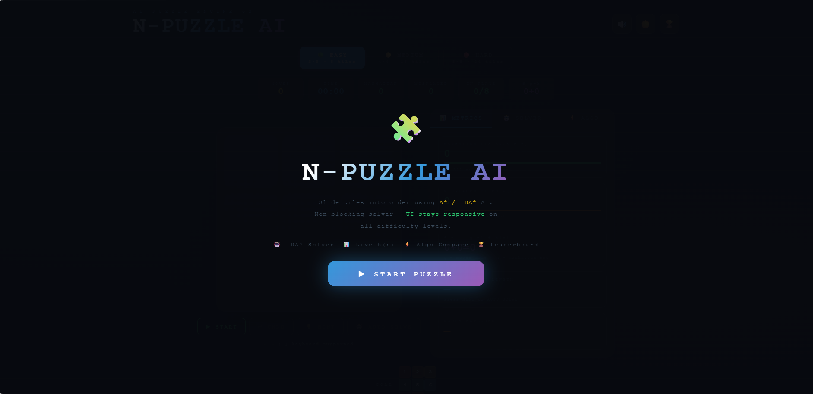

# N-Puzzle AI Game
## Live Demo
https://adyashapriyadarshini.github.io/npuzzle/
## Preview

An interactive **8-Puzzle AI solver built with React** implementing search algorithms like **A\*** and **Beam Search** with heuristic metrics and automatic solving.

## Features

- A* Search Algorithm
- Beam Search Algorithm
- Manhattan Distance heuristic
- Misplaced Tiles heuristic
- Auto-solve functionality
- Interactive and responsive UI

## Tech Stack

- React
- JavaScript
- CSS

